Visualization 04 - Hip to be geom\_ Square
================
Yujie Su, M.S. & Matthew Schuelke, Ph.D.
(October 16, 2019)

## Introduction

A plot’s geometry dictates what visual elements will be used. In this
section, we’ll familiarize you with the geometries used in the three
most common plot types you’ll encounter - scatter plots, bar charts and
line plots. We’ll look at a variety of different ways to construct these
plots.

After the data and aesthetics layers are specified, the third essential
component to all plots is the geometry layer, that is, how will the plot
actually look.

There are 37 geometries to choose from, in this part we’ll introduce 3
plot types you should have a good grasp of: scatter plots, bar plots,
and line plots.

  - Scatter plots: points, jitter, abline
  - Bar plots: histogram, bar, errorbar
  - Line plots: line

## Load Dependencies

The following code loads the package dependencies for our analysis:

``` r
# tidyverse packages
library(dplyr)    # data wrangling
```

    ## Warning: package 'dplyr' was built under R version 3.6.1

    ## 
    ## Attaching package: 'dplyr'

    ## The following objects are masked from 'package:stats':
    ## 
    ##     filter, lag

    ## The following objects are masked from 'package:base':
    ## 
    ##     intersect, setdiff, setequal, union

``` r
library(tidyr)    # data wrangling
```

    ## Warning: package 'tidyr' was built under R version 3.6.1

``` r
library(ggplot2)  # data plotting
```

    ## Warning: package 'ggplot2' was built under R version 3.6.1

``` r
library(readr)    # work with csv files
library(forecast) # time-series data
```

    ## Warning: package 'forecast' was built under R version 3.6.1

    ## Registered S3 method overwritten by 'xts':
    ##   method     from
    ##   as.zoo.xts zoo

    ## Registered S3 method overwritten by 'quantmod':
    ##   method            from
    ##   as.zoo.data.frame zoo

    ## Registered S3 methods overwritten by 'forecast':
    ##   method             from    
    ##   fitted.fracdiff    fracdiff
    ##   residuals.fracdiff fracdiff

``` r
library(here)
```

    ## Warning: package 'here' was built under R version 3.6.1

    ## here() starts at C:/Users/schuelkem/OneDrive - Saint Louis University/Data Science Seminar/repos/visualization-04

We now have the packages needed for our analyses.

## Load Data

*Dataset autocar*

``` r
cars <- read_csv(here("data", "autocar.csv")) %>%
  mutate(cyl = as.factor(cyl), 
         origin = as.factor(origin))
```

    ## Parsed with column specification:
    ## cols(
    ##   mpg = col_double(),
    ##   displacement = col_double(),
    ##   horsepower = col_double(),
    ##   weight = col_double(),
    ##   acceleration = col_double(),
    ##   cyl = col_double(),
    ##   origin = col_double(),
    ##   model_year = col_double()
    ## )

``` r
print(cars)
```

    ## # A tibble: 391 x 8
    ##      mpg displacement horsepower weight acceleration cyl   origin
    ##    <dbl>        <dbl>      <dbl>  <dbl>        <dbl> <fct> <fct> 
    ##  1    17           50         17   3504           10 8     1     
    ##  2     7           53         35   3693            8 8     1     
    ##  3    17           51         29   3436            3 8     1     
    ##  4     9           48         29   3433           10 8     1     
    ##  5    13           47         24   3449            2 8     1     
    ##  6     7           59         42   4341            1 8     1     
    ##  7     5           61         47   4354           94 8     1     
    ##  8     5           60         46   4312           93 8     1     
    ##  9     5           62         48   4425            1 8     1     
    ## 10     7           57         40   3850           93 8     1     
    ## # ... with 381 more rows, and 1 more variable: model_year <dbl>

*Dataset woolyrnq*

This data is the quaterly production of woolen yarn in Australia,
included in the package “forecast”.

``` r
wool <- readxl::read_xlsx(here("data", "woolyrnq.xlsx"))
print(wool)
```

    ## # A tibble: 29 x 5
    ##     Year  Qtr1  Qtr2  Qtr3  Qtr4
    ##    <dbl> <dbl> <dbl> <dbl> <dbl>
    ##  1  1965  6172  6709  6633  6660
    ##  2  1966  6786  6800  6730  6765
    ##  3  1967  6720  7133  6946  7095
    ##  4  1968  7047  6757  6915  6921
    ##  5  1969  7064  7206  7190  7402
    ##  6  1970  7819  7300  7105  7259
    ##  7  1971  7001  7475  6840  7061
    ##  8  1972  5845  7529  7819  6943
    ##  9  1973  5714  6556  7045  5947
    ## 10  1974  5463  6127  5540  4235
    ## # ... with 19 more rows

*Dataset Wineind*

Wineind is data of total Australian wine sales by wine makers (in
bottles) from January 1980 to August 1994, included in package
“forecast”

Now, you try to load dataset “wineind.csv”

## Scatter Plot

Let’s begin with scatter plots. We’ve already generated some of these in
the previous chapter using the geom point function. All the geometries
that we just showed can be accessed via its own geom\_ function.

In addition, each geom is associated with specific aesthetic mappings,
some of which are essential. For example, to use geom point, we need to
have an X and Y aesthetic.

``` r
ggplot(cars, aes(x = weight, y = mpg)) + 
  geom_point()
```

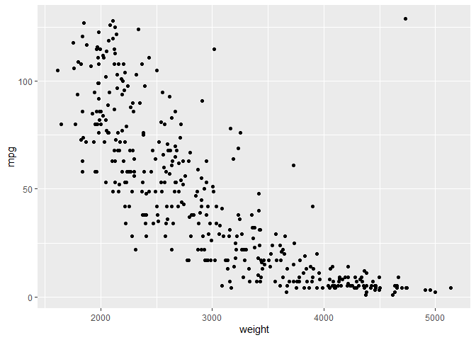<!-- -->

In addition to the essential aesthetics, we could also choose optional
aesthetics. For geom point, we could have also specified alpha, color,
fill, shape or size as aesthetic mappings, as shown blow, or as
attribute settings, as we discussed in the last section.

``` r
ggplot(cars, aes(x = weight, y = mpg, col = cyl)) + 
  geom_point()
```

<!-- -->

A very convenient feature of ggplot is the ability to specify aesthetics
for a given geom inside the geom fuction, as shown below. This is a very
useful tool, because we’re going to begin layering many geoms on top of
each other and it means we can control the aesthetic mappings of each
layer independently.

``` r
ggplot(cars, aes(x = weight, y = mpg)) + 
  geom_point(aes(col = cyl))
```

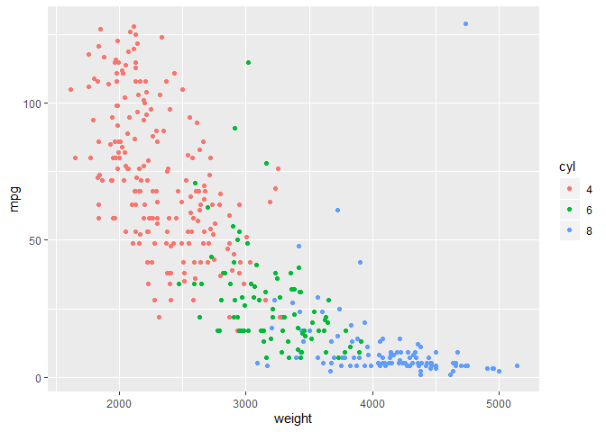<!-- -->

Here it doesn’t make any difference, but we’ll see why it’s important
shortly. Not only can we assign aesthetic mappings to a specific geom,
but we can also specify the data layer inside the geom function.

This is helpful for when I have a data frame that contains summary
statistics, such as the mean, for each of my variables. In the case
where I have the average mpg and weight for each of cyl category, if I
want to make a scatter plot showing all the individual points and have
the mean of X and Y plotted on top, I could add another geom point layer
accessing this dataset.

``` r
# First let's create a dataset with summary data
cars %>% 
  group_by(cyl) %>%
  summarize(weight = mean(weight),
          mpg = mean(mpg)) -> cars_cyl

# Second plot the raw data and summary data via two layers
ggplot(cars, aes(x = weight, y = mpg, col = cyl)) +
  geom_point() + 
  geom_point(data = cars_cyl, aes(shape = cyl), size =5)
```

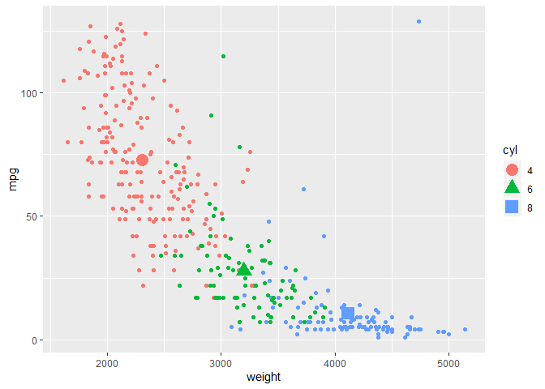<!-- -->

So, in this plot I have two geom point layers, one inherits the data and
aesthetics from the parent ggplot function, and the other I specify from
a different dataset.

I don’t need to redefine the aesthetics, such as X, Y, and color in the
second geom function because they are also inherited as from the first
geom fuction.

Notice that I have specified the shape and size attributes of the second
layer, so they are distinguishable from the background points.

Now, you try to create a scatter plot. Map mpg onto the Y axis, weight
onto the X axis, and origin onto color. Then add the second layer
indicates the mean of each origin category.

Here is the summary dataset of your second layer.

``` r
cars_origin <- cars %>% 
  group_by(origin) %>%
  summarize(weight = mean(weight),
          mpg = mean(mpg)) 
```

``` r
# Create a scatter plot, map mpg onto Y axis, weight onto X axis and map origin onto color. Then add the second layer, using plots indicates the mean of each origin category
```

## Crosshairs

Instead of adding a point, I want to have crosshairs marking where each
mean value appears on the plot. This time I can use the geom\_vline
command to add vertial lines and the geom\_hline command to add
horizontal lines.

``` r
ggplot(cars, 
       aes(x = weight, y = mpg, col = cyl)) +
  geom_point() + 
  geom_vline(data = cars_cyl, 
             aes(xintercept = weight, col = cyl)) + 
  geom_hline(data = cars_cyl, 
             aes(yintercept = mpg, col = cyl))
```

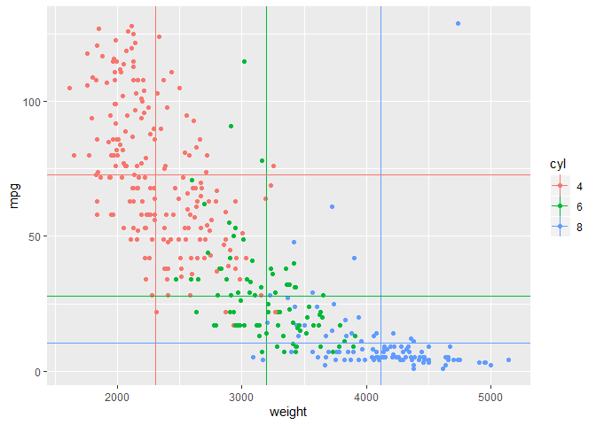<!-- -->

Now, it’s your turn to make crosshairs of each mean value after group by
origin.

``` r
# Create a scatter plot, map mpg onto Y axis, weight onto X axis and map origin onto color. Then add the second layer, using crosshairs indicates the mean of each origin category.
```

*geom\_jitter*

We can use the position argument to change the position of identity to
jitter. We will use the geom\_jitter() function. geom\_jitter() is a
wrapper for geom\_point with position set to jitter. On top of
jittering, we would also deal with the over-plotting of the points by
adjusting the alpha blending, which works great as an attribute. This
helps us to see regions of high density.

``` r
ggplot(cars, aes(x = acceleration, y = displacement, col = cyl)) + 
  geom_jitter(alpha = 0.5) 
```

<!-- -->

Another way to deal with over-plotting is to change the symbol to a
hollow circle, where the shape equals one. We can more accurately and
quickly see what the data is actually showing, even if the jittering
adds some noise to both axes.

``` r
ggplot(cars, aes(x = acceleration, y =displacement, col = cyl)) + 
  geom_jitter(shape = 1)
```

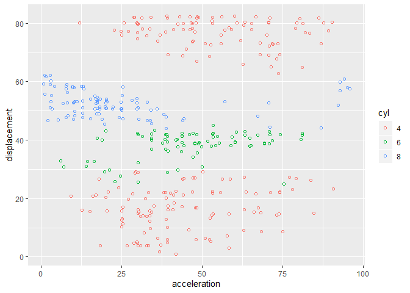<!-- -->

## Bar plot

*geom\_histogram*

In this section, we’ll take a look at the typical uses of bar plots and
their associated geoms. We’re going to begin by discussing one of the
most useful types of bar plots, the histogram, which shows the binned
distribution of a continuous variable.

To make a histogram we just need to specify a single aesthetic, X, which
is a continuous variable of interest. The output allows us to see the
typical features of a histogram. Notice that geom histogram doesn’t
actually plot our data, it plots a statistical function to our data set.
So instead, what we have are bins and not actually our original data.

There is always a message reported with geom histogram to let you know
what happened. The message refers to the stat bin, which should give you
an idea that this geom is associated with a specific statistic.

``` r
ggplot(cars, aes(x = mpg)) + 
  geom_histogram()
```

    ## `stat_bin()` using `bins = 30`. Pick better value with `binwidth`.

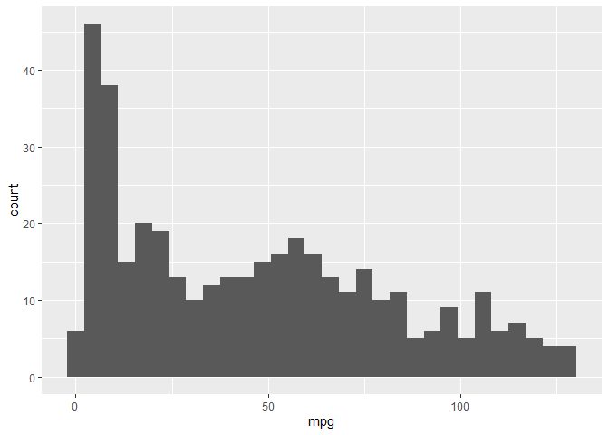<!-- -->

``` r
diff(range(cars$mpg))
```

    ## [1] 128

The message told us that the bin argument took the default value of
range over 30, but of course we can change this.

Let’s change that and see what happens.

``` r
ggplot(cars, aes(x = mpg)) + 
  geom_histogram(binwidth = 5)
```

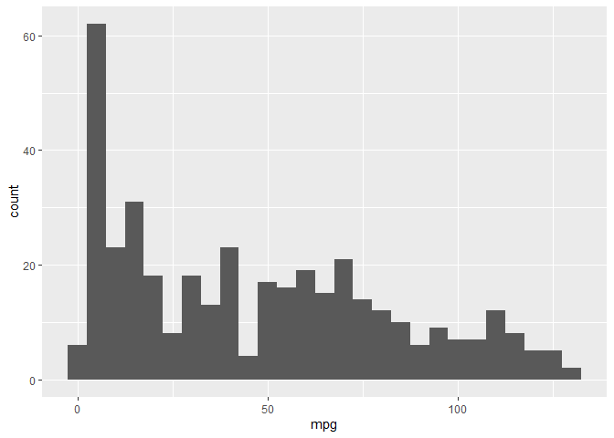<!-- -->

Changing the width to 5 already gives us a better impression of our
data. There are many ways to choose the binning statistic, but there is
no one best way, so we need to use some common sense.

Another thing to know about histograms is there is no space between the
bars. That’s to emphasize that this is a representation of an underling
continuous distribution. The Y axis shows the absolute count of each
bin.

Another way to look at this would be to ask what proportion of the total
is represented in each bin. We can alternatively refer to this as the
frequency of density. To gain access to the density, we’re going to
manually assign a y aesthetic and call that column.

We use .. before and after we calling density, this is to tell ggplot
that the column containing the density values is not to be found in my
original data frame, but rather in the internal data frame. The shape of
the histogram has not changed at all, but the y axis has been relabeled.

``` r
ggplot(cars, aes(x = mpg)) + 
  geom_histogram(aes(y = ..density..), binwidth = 5)
```

<!-- -->

We have three kinds of cyl in our dataset, so we can color our bars in
accordance with cyl. This makes it clear that we have three histograms
in the same plotting space.

``` r
ggplot(cars, aes(x = mpg, fill = cyl)) + 
  geom_histogram(binwidth = 5)
```

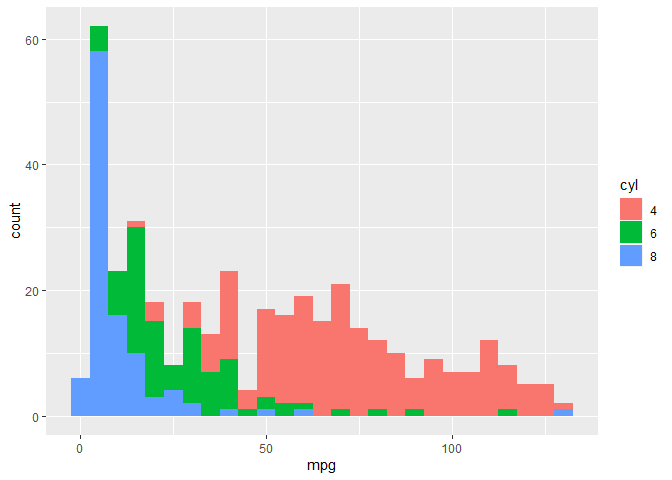<!-- -->

There is a perceptual problem here, because it is not immediately clear
if the bars are overlapping or if they are stacked on top of each other.
The default is that they are stacked, but we have some alternative
positions we can specify

  - dodge: offset each data point in a given category

  - fill: normalizes each bin to represent the proportion of all
    observations in each bin taken by each category. The y axis label
    didn’t change, but it should say proportion, not count.

<!-- end list -->

``` r
ggplot(cars, aes(x = mpg, fill = cyl)) + 
  geom_histogram(binwidth = 5, position = 'dodge')
```

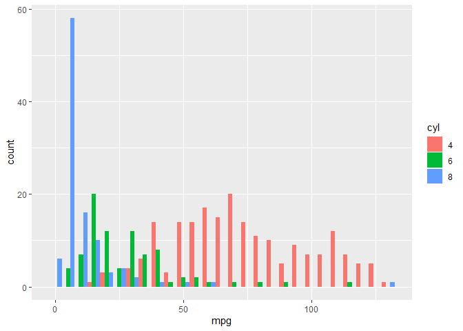<!-- -->

``` r
ggplot(cars, aes(x = mpg, fill = cyl)) + 
  geom_histogram(binwidth = 5, position = "fill")
```

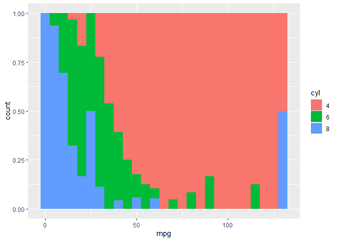<!-- -->

Now, try to create your own histogram of mpg using “fill” to seperate
cars with different origins and arraning the bars with position =
“dodge”.

``` r
# set aesthetic fill into origin
# Find a approariate binwidth for this polt
# set position into "dodge"
```

*geom\_bar*

A histogram is a special version of a bar plot. To make a bar plot
proper, we need to use the geom\_bar function. There are two types of
bar plot,

  - Absolute counts
  - Distributions

In the bar chart blow the data were counted and that count was plotted.
So, once again, there were some statistics which occurred under the
hood, in this case there was a default value of bin set for the stat
argument.

These kinds of plots are useful in getting a quick visual output.

``` r
ggplot(cars, aes(cyl)) + geom_bar()
```

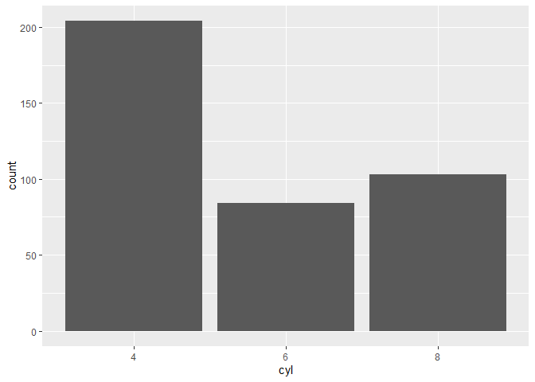<!-- -->

However, we often see another type of barplot, which tries to depict the
distribution of a dataset. Let’s consider a scenario similar to what we
saw with the geom\_point. What we have is a dataset with the summary
value already calculated.

If we want to plot the average mpg for each kind of cyl, we can refer to
the column in our data set containing the averages.

geom\_errorbar has the option to add error bars, so here we add error
bars of 95% CI.

Again, we need to specify some aesthetics to this geom, namely ymin and
ymax.

``` r
cars %>% 
  group_by(cyl) %>%
  summarize(avg_mpg = mean(mpg),
            std = sd(mpg),
            n = n(), 
            m = 1.96*std/sqrt(n)) -> summ_cyl

print(summ_cyl)
```

    ## # A tibble: 3 x 5
    ##   cyl   avg_mpg   std     n     m
    ##   <fct>   <dbl> <dbl> <int> <dbl>
    ## 1 4        73.0  26.2   204  3.59
    ## 2 6        27.9  18.6    84  3.97
    ## 3 8        10.4  15.1   103  2.92

``` r
ggplot(summ_cyl, aes(x = cyl, y = avg_mpg)) + 
  geom_bar(stat = "identity", fill = "grey50") + 
  geom_errorbar(aes(ymin = avg_mpg - m, ymax = avg_mpg + m), 
                width = 0.2)
```

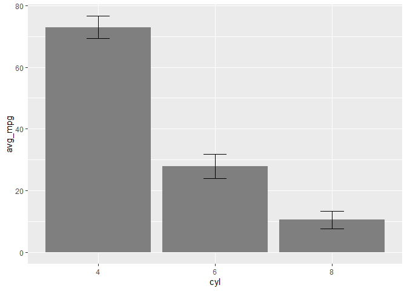<!-- -->

On top of that, I have set the width of the error bar tips to be narrow
and I’ve made the fill of the bars themselves gray, so that we can see
the error bars. This is the kind of plot that you’ll typically see in a
scientific publication, but it’s pretty terrible.

Now you try to plot the average of mpg of each origin category, add the
error bars.

Here is the summarized table

``` r
cars %>% 
  group_by(origin) %>%
  summarize(avg_mpg = mean(mpg),
            std = sd(mpg),
            n = n(), 
            m = 1.96*std/sqrt(n)) -> summ_origin
```

Create your plot here

## Line Plots - Time Series

Line plots are another typical type of plot we’ll encounter. In this
part we will explore the geom\_line function and a couple nice
alternative plot types.

woolyrnq dataset is the quarterly production of woolen yarn in
Australia, which is from package forecast. We read this data in earlier
under the name `wool`.

As we talked before, this is wide data, where the value in columns Qtr1,
Qtr2, Qtr3 and Qtr4 are all production and they should belong to the
same variable. Let transform this table first.

``` r
wool <- gather(wool, "Qtr", "Prod", -Year)
```

Our basic line plot is pretty straightforward, we follow the syntax
we’ve seen so far. This is the simplest case scenario with only a
single time series.

``` r
ggplot(wool, aes(x = Year, y = Prod)) + 
  geom_line()
```

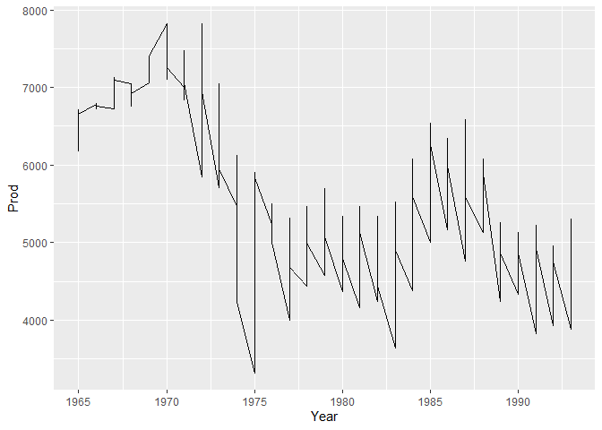<!-- -->

Now, you try to explore another dataset, wineind, which also comes from
the forecast package. Transform it into the easily used format.

When we want to compare many different groups, each group can be
represented with a line.

The series can be encoded using line type, which is seen as dashes, and
size, which means the thickness or color.

``` r
ggplot(wool, aes(x = Year, y = Prod, linetype = Qtr)) + 
  geom_line()
```

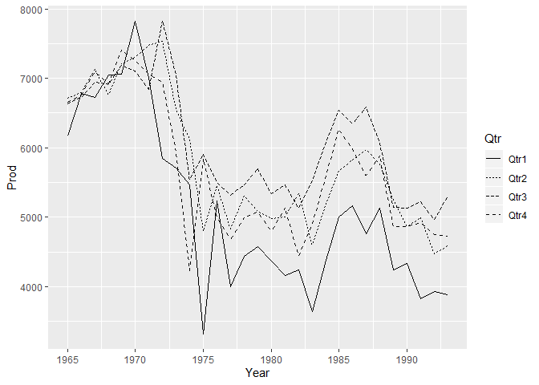<!-- -->

Consider this plot, which compares the wool production of 4 different
quarters from 1965 to 1993. The abundance of line types makes it
difficult to distinguish individual series when using line type.

The most salient choice is color, when available, since it allows the
easiest way of distinguishing between each series.

Using color to encode the series results in immediately discernible
groups, so we’ll stick with this aesthetic mapping.

``` r
ggplot(wool, aes(x = Year, y = Prod, col = Qtr)) + 
  geom_line()
```

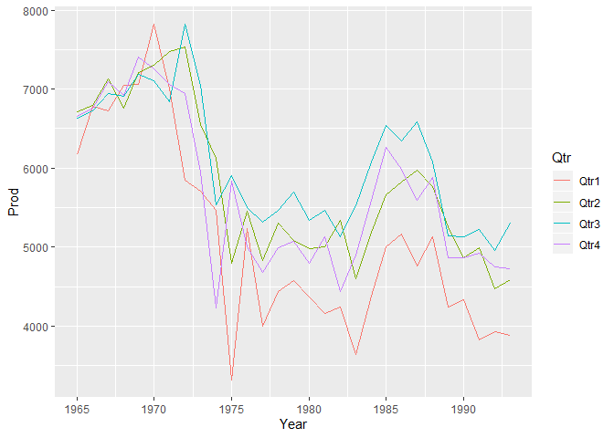<!-- -->

Now, you try to create a line plot to compare sales of different months
in each year.

*geom\_area*

There are couple of alternatives to showing lines. For example, we could
have used an area fill, with geom area, which defaults to position =
stack. So instead of overlapping time series, they are added together at
each point.

``` r
ggplot(wool, aes(x = Year, y = Prod, fill = Qtr)) + 
  geom_area()
```

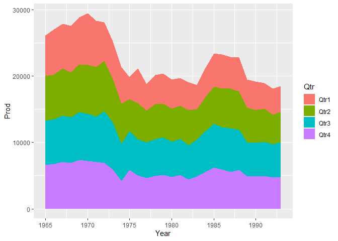<!-- -->

Just like the geom\_bar position, we can also adjust this to position =
“fill”, which means that for each time point, we have a proportion of
the total capture represented by each quarter.

``` r
ggplot(wool, aes(x = Year, y = Prod, col = Qtr, fill = Qtr)) + 
  geom_area(position = "fill")
```

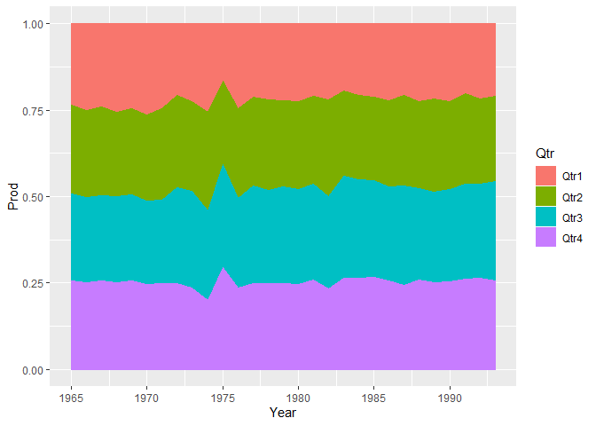<!-- -->

This kind of plot is useful in looking at proportional trends over time,
and in this case, it gives a good impression of which quarters are most
productive.

However, one difficulty with this kind of plot is that only the bottom
and top groups are actually drawn on the common scale. All the other
ones are irregular shapes so they can be a bit difficult decipher.

The final type of plot we’ll look at here is in the scenario where we
have overlapping area plots.

*geom\_ribbion*

In this case we’d have to use geom\_ribbion and force the y\_min to 0.
Here, we set the alpha level so we can see the overlap. There is still a
challenge in deciphering all of the time series, in particular at the
bottom, where there are many overlapping series.

``` r
ggplot(wool, aes(x = Year, y = Prod, fill = Qtr)) + 
  geom_ribbon(aes(ymax = Prod, ymin = 0), alpha = 0.3)
```

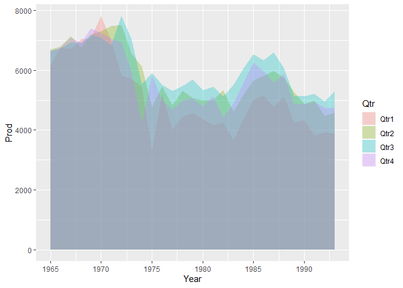<!-- -->

Now, it’s your turn to create an appropriate plot compare Sales among
different months in each year.
